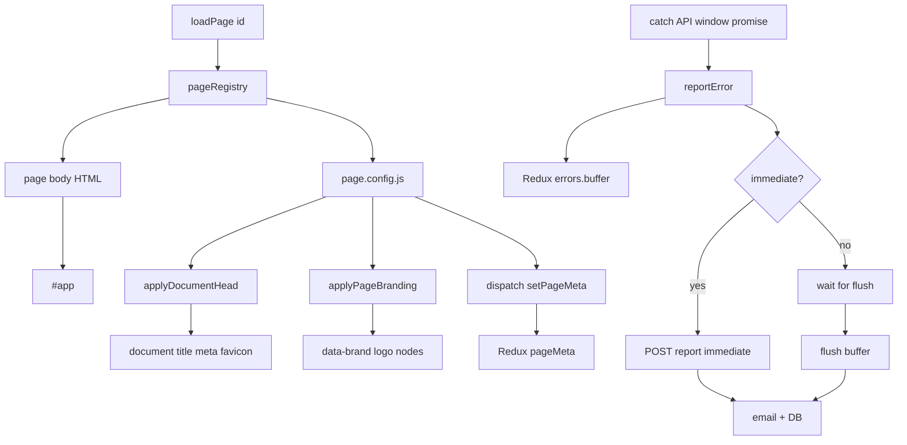

# SPA Page Meta, Branding, and Error Reporting — Design

**Date:** 2026-10-07  
**Repo:** `impact_vite`  
**Status:** Approved  
**Related legacy:** `impact_qa` (static HTML heads, gulp `${{page_title}}$` / `${{client_favicon}}$`, landing-pages JSON)

## Problem

Legacy IMPACT pages hardcode `<title>`, meta, favicon, and logos in each HTML snippet (or gulp placeholders). The Vite SPA loads page HTML into `#app`, so in-fragment `<head>` tags do not apply. Migration needs a Vite-native, dynamic, per-page config model that also prepares for React and for a Redux-centered error reporting pipeline.

## Goals

1. Per-page document head (title, description, keywords, favicon, apple-touch-icon) applied at runtime on navigate.
2. Per-page chrome branding (header/login logos, product name) from the same config.
3. Co-located config inside each page folder; thin registry; shared helpers; Redux for active page meta.
4. Home and login fully wired first; editor and dashboard get config stubs.
5. Unit (Vitest), harness, and Playwright e2e coverage for head/branding behavior.
6. Redux error buffer with flush-by-area and immediate notify (fixed list + opt-in).
7. Helpers stay framework-agnostic so a future React layer can reuse them.

## Non-goals (this design)

- Full editor migration or loading CKEditor4 / TipTap / Summernote / WebSpellCheck.
- Implementing the Java/backend mailer and DB schema (contract only: report API).
- Tenant white-label API fetch (shape allows a later merge; not required for v1).
- Replacing all legacy gulp `${{VERSION}}$` asset pipelines in one step.

## Decisions locked

| Topic | Decision |
|--------|----------|
| Driver for meta/branding | Runtime per-page config (Approach 1), not HTML scrape or build-only inject |
| Config location | Co-located `page.config.js` in each page folder |
| Registry | Thin map of page id → dynamic import of that folder’s config (and HTML loader) |
| Head + logos | One config owns both |
| Redux page meta | Store **current** page config only; DOM apply via shared helpers |
| v1 pages | Real: home, login. Stubs: editor, dashboard |
| Immediate errors | **C** — fixed critical list + opt-in `severity: 'immediate'` |
| Buffered flush | login/admin/dashboard: leave/session end; editor: logout |
| Testing | Vitest unit + harness fixtures + Playwright e2e |

## Architecture



## Folder layout

```text
src/
  pages/
    home/
      index.html          # body only (no <head>)
      page.config.js
      index.js            # page behavior as needed
    login/
      login.html          # body only
      page.config.js
    editor/
      page.config.js      # stub
    dashboard/
      page.config.js      # stub
  shared/
    documentHead.js       # applyDocumentHead(config)
    pageBranding.js       # applyPageBranding(root, config)
    reportError.js        # classify + dispatch + optional immediate send
  routing/
    pageRegistry.js       # id → loaders
  middleware/redux/
    pageMetaSlice.js
    errorsSlice.js
    store.js
tests/
  unit/                   # Vitest
  harness/                # isolated HTML/JS fixtures for helpers
  e2e/                    # Playwright
```

Root `index.html` keeps only safe defaults (charset, viewport, fallback title/favicon). Page fragments must not include a full document `<head>`.

## Page config shape

Every `page.config.js` exports a default object:

```js
export default {
  id: 'home',                    // required: home | login | editor | dashboard | …
  title: 'IMPACT',               // required
  description: '',               // optional
  keywords: '',                  // optional
  favicon: '/assets/…/ng_favicon.ico',
  appleTouchIcon: '/assets/…/ng_favicon.ico',
  productName: 'IMPACT',
  logos: {
    header: '/assets/…/logo.png',
    login: '/assets/…/IMPACT_5_4.svg', // omit when unused
  },
};
```

**Registry** holds no branding values — only loaders:

```js
export const pages = {
  home: () => import('../pages/home/page.config.js'),
  login: () => import('../pages/login/page.config.js'),
  editor: () => import('../pages/editor/page.config.js'),
  dashboard: () => import('../pages/dashboard/page.config.js'),
};
```

**DOM branding hooks:** page HTML uses stable markers such as `data-brand="header-logo"` and `data-brand="login-logo"`. Helpers set `src` and `alt` (alt from `productName` when appropriate).

### Example titles (v1)

| Page | title |
|------|--------|
| home | `IMPACT` |
| login | `IMPACT \| Log In` |
| editor (stub) | `IMPACT \| Editor` |
| dashboard (stub) | `IMPACT \| Dashboard` |

## Loader + Redux flow (page meta)

On `loadPage(id)`:

1. Resolve registry entry; load config (and page HTML).
2. Inject body HTML into `#app` (strip any accidental outer html/head/body if present).
3. `dispatch(setPageMeta(config))`.
4. `applyDocumentHead(config)` — set `document.title`; upsert meta description/keywords; upsert `link[rel="icon"]` and `link[rel="apple-touch-icon"]`.
5. `applyPageBranding(document.getElementById('app'), config)` — update `[data-brand]` nodes present for that page.

In-app navigation (e.g. home → login) uses the same `loadPage` path (no full document reload).

**React future:** keep `applyDocumentHead` / `applyPageBranding` / `reportError` as plain modules; React routes call them (or a thin `useDocumentHead` wrapper) with the same config objects.

## Error reporting

### Redux `errors` slice

- `buffer[]` — `{ id, pageId, type, message, stack?, meta?, ts, severity, alreadyNotified }`
- `pendingImmediate` — in-flight immediate requests
- `lastFlushStatus` — last flush result for diagnostics

### `reportError(payload)`

1. Normalize payload; attach `pageId` from current `pageMeta` when omitted.
2. Always push onto `errors.buffer`.
3. If immediate (see below), call `POST /api/errors/report` (or agreed path) with `{ mode: 'immediate', errors: [item] }` and mark `alreadyNotified: true` on success.
4. Never throw from the reporter into the UI path; log failures to console / `lastFlushStatus`.

### Immediate vs buffered

**Always buffered.**

**Also immediate** when either:

1. **Fixed list (v1):**
   - `window` `error` / `unhandledrejection`
   - Login auth API HTTP 5xx
   - Editor save failure
   - Collaboration/socket hard failure
2. **Opt-in:** caller sets `severity: 'immediate'` (or equivalent `notify: 'now'`).

### Flush rules

| Area | When to flush buffer |
|------|----------------------|
| login, admin, dashboard | on leave / session end (optional periodic flush later). Until an `admin` page folder exists, treat admin UI under `dashboard` (or a future `admin/` page) with the same flush rule. |
| editor | on logout; best-effort `beforeunload` / `pagehide` |

Flush payload: `{ mode: 'digest', pageId, errors: buffer }`. Backend sends admin email and persists DB. Items with `alreadyNotified: true` may be included for a complete digest; backend may suppress duplicate emails.

### Backend contract (frontend assumption)

Single report endpoint accepts immediate and digest modes. Exact Java implementation, mail templates, and DB tables are out of scope for this frontend design; stub or mock the client in tests until the API exists.

### Relation to page-meta v1

Ship page meta/branding for home + login first. Land `errors` slice + `reportError` + global listeners in the same effort when practical; wire real flush/immediate HTTP when backend is ready. Do not block head/branding on mail/DB.

## Testing

| Layer | Tool | Coverage |
|--------|------|----------|
| Unit | Vitest | `applyDocumentHead`, `applyPageBranding`, `pageMeta` slice, `errors` slice / classify rules, required keys on each `page.config.js` |
| Harness | `tests/harness/` + Playwright | Isolated fixture pages that mount helpers + sample config without full app shell |
| E2E | Playwright | Vite preview/dev: home title/favicon/header logo; navigate login → title/favicon/login logo update; optional error reporter unit via harness |

**Scripts (target):** `test:unit`, `test:harness`, `test:e2e`.

**v1 e2e cases:** head tags update on `loadPage('login')`; logo `data-brand` updates; favicon not stale after route change. Editor/dashboard: config stub unit checks only until pages exist.

**Error tests (v1):** unit tests for classify (immediate vs buffer); harness test that buffer accumulates; e2e can mock the report API.

## Migration notes from legacy

- Replace static `<link rel="icon">` / `<title>` in copied snippets with runtime config.
- Prefer Vite asset URLs / `public/` paths over gulp `${{VERSION}}$` in new pages.
- Legacy landing JSON (`page_title`, `client_favicon`) maps cleanly onto `page.config.js` fields for a later tenant merge.
- Do not port full document HTML into `#app`; body-only fragments only.

## Success criteria

1. Navigating home ↔ login updates `document.title`, favicon, and relevant logos without full reload.
2. Each page’s branding/meta lives in its folder’s `page.config.js`.
3. Active page config is readable from Redux `pageMeta`.
4. Unit, harness, and e2e tests for the above are present and pass locally.
5. Errors accumulate in Redux; immediate path and flush rules are defined and unit-tested; API client is mockable.

## Open follow-ups (explicit, not blockers)

- Exact report API path and auth headers (align with Tomcat backend when available). Default client path until then: `POST /api/errors/report`.
- Whether admin is its own `pages/admin/` folder or lives under `dashboard` when migrated.
- Tenant/runtime branding merge (future B) into the same config shape.
- Editor plugin loading strategy (separate design).
