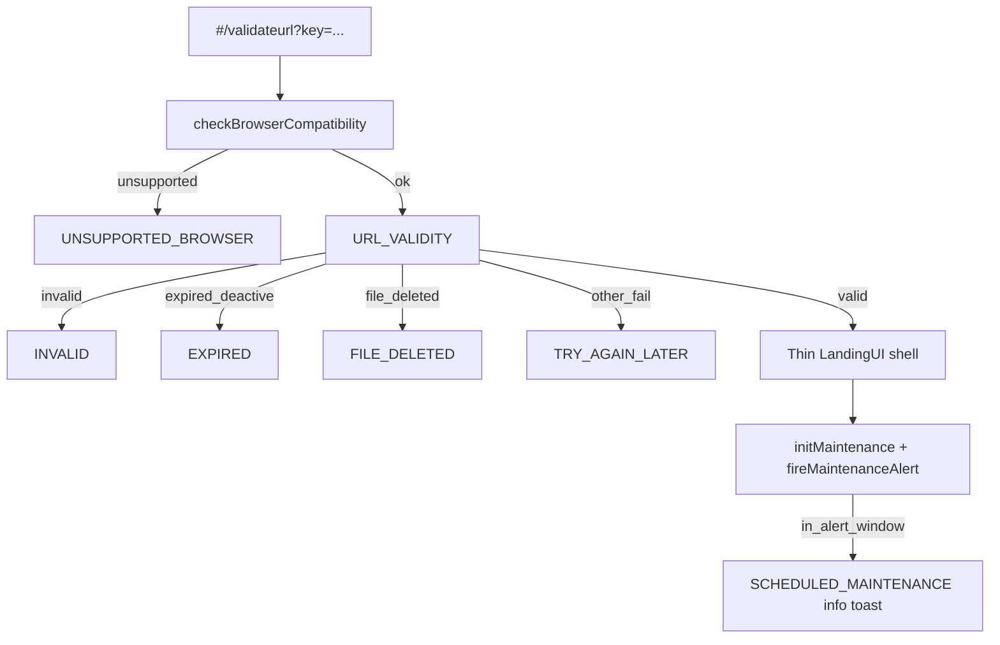

# Thin landing shell + maintenance toast

**Date:** 2026-10-08  
**Status:** Approved for planning  
**Repo:** impact_vite  
**Depends on:** [2026-10-08-validate-url-browser-check-design.md](./2026-10-08-validate-url-browser-check-design.md)

## Goal

After a successful shared-mail `urlvalidity` check on `#/validateurl`:

1. Automatically open a **thin LandingUI shell** (in-page; no new hash route)
2. Run **scheduled maintenance** check and show an informational toast when in the alert window
3. On any validate/browser failure, stay on the validate error UI and show existing keys from `src/pages/landing/messages/landingMessages.js` (including `INVALID`)

Full client LandingUI (session, PLOS, download, branding logos) remains out of scope.

## Locked decisions

| Topic | Choice |
|-------|--------|
| Success order | Browser OK → `urlvalidity` → valid → thin LandingUI → then maintenance toast |
| Failures | Existing landing message keys only; no landing shell; no maintenance toast |
| Landing depth | Approach 1 — thin shell + maintenance |
| Maintenance | Informational only; never blocks validate or landing |
| Source paste | `temp/react-paste-unused/landing/maintenanceGuard.js` (+ message template) |
| Navigation | In-page swap on `ValidateUrlPage` (`showLanding`), not a separate route |

## Architecture

## Components & files

### Live under `src/pages/landing/`

| File | Role |
|------|------|
| `ValidateUrlPage.jsx` | Keep validate flow; on valid set success then after ~800ms `setShowLanding(true)`; lazy-load thin shell |
| `LandingUI.jsx` (new, slim) | Show `docData` title/client stub + placeholder CTA; on mount run maintenance init + toast |
| `maintenanceGuard.js` (new) | Port from paste; imports live `apiService` + landing messages |
| `messages/landingMessageKeys.js` | Add `SCHEDULED_MAINTENANCE` |
| `messages/landingMessages.js` | Add `SCHEDULED_MAINTENANCE` HTML with `{{T1}}` / `{{T1A}}` / `{{T2}}` / `{{T2A}}` (end meridiem uses `T2A`); keep fail keys unchanged |
| `messages/index.js` | Already interpolates `{{var}}`; no API change expected |

### Shared / middleware

- `API_ENDPOINTS.GET_DOCS` for `ServerMaintenance` query (`status: active`, `starttime > now`, length 1, sort ascending)
- Maintenance toast: SweetAlert2 top info toast inside `maintenanceGuard.fireMaintenanceAlert` (paste behavior); must not throw into validate error path

### Out of scope

- Full paste `LandingUI` (session tab claim, PLOS auth, download service, client logo/config overrides)
- App-wide maintenance on login/dashboard/home
- Replacing HTML `#/` marketing home

## Error mapping (validate failures)

| Condition | Message key |
|-----------|-------------|
| Missing `key` | `INVALID` |
| API `invalid` / broken payload | `INVALID` |
| `expired` / `deactive` | `EXPIRED` |
| `file_deleted` | `FILE_DELETED` |
| Unsupported browser | `UNSUPPORTED_BROWSER` |
| Other / network | `TRY_AGAIN_LATER` |

## Maintenance behavior

1. Only after thin `LandingUI` mounts on a **valid** validate path.
2. `await initMaintenance({ init: true })` loads schedule from DB; computes `ALERT_START` (default 48h before start; end defaults to start + 2h if missing).
3. `fireMaintenanceAlert()` shows top info toast when `ON` and `now >= ALERT_START`; otherwise no-op.
4. DB/API failure → silent clear schedule; never surface as validate failure.

## Testing

- Unit: `parseEpoch` / schedule window / `canShowAlert`; `SCHEDULED_MAINTENANCE` interpolation
- E2E: mock valid `urlvalidity` → landing shell visible → mock maintenance row → toast appears; mock invalid key → `INVALID` Swal, no landing shell
- Build green

## Success criteria

- Valid link: user sees thin landing shell without clicking Continue; maintenance toast when schedule is in alert window
- Invalid/expired/missing/unsupported: correct existing message; no landing; no maintenance toast
- Maintenance never blocks access to the shell
