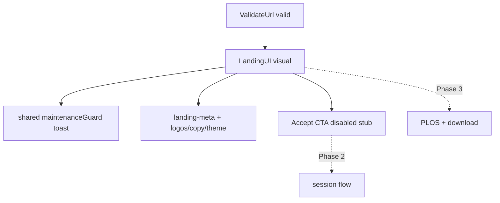

# LandingUI Phase 1 — Visual + branding (toward full paste)

**Date:** 2026-10-08  
**Status:** Approved for planning  
**Repo:** impact_vite  
**Depends on:**  
- [2026-10-08-validate-url-browser-check-design.md](./2026-10-08-validate-url-browser-check-design.md)  
- [2026-10-08-landing-shell-maintenance-design.md](./2026-10-08-landing-shell-maintenance-design.md)

## Goal

Replace the thin post-validate landing stub with a **paste-derived visual LandingUI** (logos, theme, cover, copy, maintenance toast), while **deferring** session Accept, PLOS auth, and download services to later phases.

**Roadmap end state:** Full paste LandingUI (option C), delivered as sequenced phases.

## Locked decisions

| Topic | Choice |
|-------|--------|
| End state | Full paste LandingUI (C) |
| Delivery | Sequenced: (1) visual+branding+maintenance → (2) session Accept → (3) PLOS+download |
| Phase 1 approach | Replace thin shell in place under `src/pages/landing/` |
| Source | `temp/react-paste-unused/landing/` (rephrase/adapt, not blind copy) |
| Maintenance | Canonical [`src/shared/maintenanceGuard.js`](../../src/shared/maintenanceGuard.js); LandingUI mounts it |
| Session / PLOS / download | Out of Phase 1 — stub CTAs |

## Architecture (Phase 1)

- Validate → ~800ms → in-page LandingUI unchanged.
- No new hash route.

## Files (Phase 1)

### Under `src/pages/landing/`

| File | Role |
|------|------|
| `LandingUI.jsx` | Paste UI rephrased: `tw:` classes, `react-icons`, maintenance on mount; session/PLOS/download stubbed |
| `landingTheme.js` | Theme tokens from paste |
| `landingCopy.js` | Client copy; imports live meta JSON |
| `landingLogos.js` | Public `/assets/logo/...` resolution |
| `landingDocumentInfo.js` | Cover URL + publication title |
| `landingAccess.js` | `isPlosClient` (UI branches only; no PLOS panel) |
| `landingConfigService.js` | Branding override from `docData.branding` / optional wrapper |
| `config/landing-meta.json` | Client logo/theme map; port if found, else minimal `default` + known clients |

### Shared

| File | Role |
|------|------|
| `src/shared/maintenanceGuard.js` | Sole maintenance module (editor + landing) |
| `src/shared/utils/sanitizeHtml.js` | Lightweight welcome-HTML sanitize (no DOMPurify) |

### Explicitly not in Phase 1

- `useLandingSessionFlow`, `sessionDialogs`, `plos/*`, download service, `MarketingLandingPage`
- Adding `lucide-react`

### ValidateUrlPage

- Keep lazy LandingUI + auto `showLanding`
- Keep fail messages (`INVALID`, etc.)
- Extend e2e selectors for visual chrome as needed; preserve `data-testid="landing-shell"` on root (or equivalent stable test id)

## Adaptations

- Tailwind v4: paste utilities → `tw:` prefix; extend `@theme` only for banner colors LandingUI needs.
- Icons: map lucide → `react-icons` (Fi*/Hi* equivalents).
- Logos: use existing [`public/assets/logo/`](../../public/assets/logo/).
- Welcome HTML: sanitize before `dangerouslySetInnerHTML`.

## CTA stubs

- Accept/Continue: visible, **disabled** (no session call).
- PLOS panel: not loaded.
- FAQ/Guide: static meta URLs only.

## Testing

- Unit: logo slot / cover URL / sanitize; maintenance suite still passes.
- E2E: valid → landing chrome + title; maintenance toast when schedule mocked; invalid → no landing.
- Build green.

## Success criteria (Phase 1)

- After valid validate, user sees paste-like branded landing (not the thin stub card).
- Maintenance info toast still fires from shared guard when in alert window.
- Accept does not start a session.
- Fail paths unchanged.

## Later phases (out of this spec’s implementation)

- **Phase 2:** Port session middleware + `useLandingSessionFlow`; enable Accept → editor.
- **Phase 3:** PLOS auth panel + download service for FAQ/Guide.
