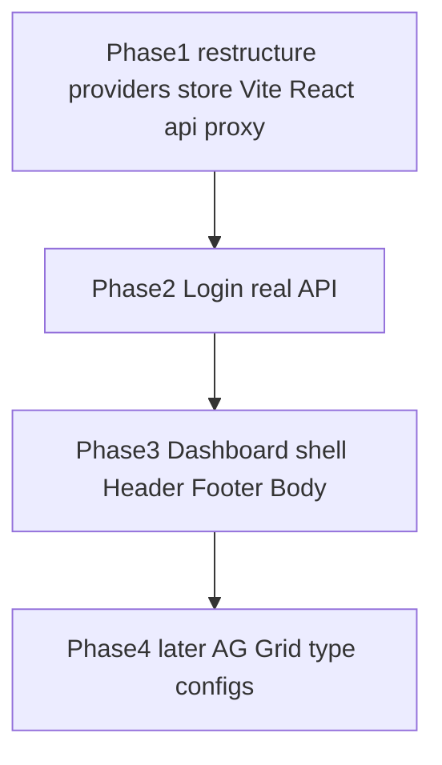
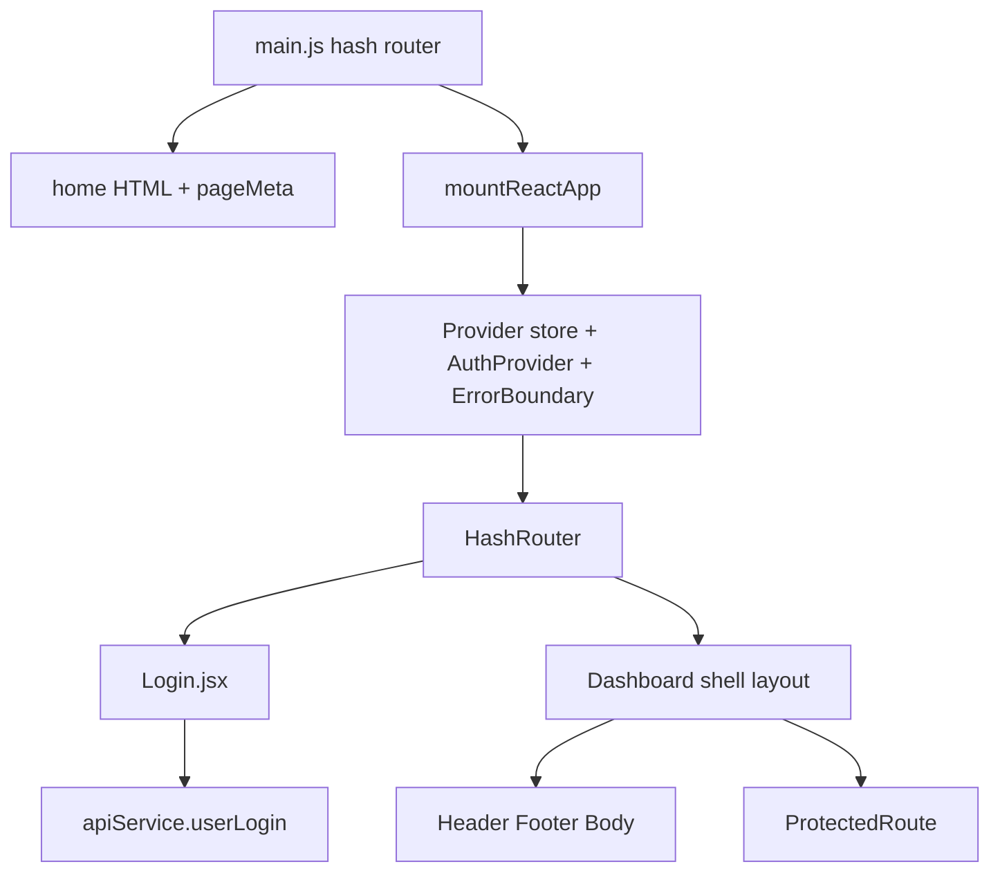

# Login + Dashboard React Wiring — Design

**Date:** 2026-10-08  
**Repo:** `impact_vite`  
**Status:** Approved for spec review  
**Branch context:** `feat/spa-page-meta-branding` (page meta already landed)  
**Related:** [2026-10-07-spa-page-meta-and-error-reporting-design.md](./2026-10-07-spa-page-meta-and-error-reporting-design.md)

## Problem

React login, dashboard, providers, and API code were pasted from a React IMPACT app into this Vite SPA, but:

- React / JSX tooling is not wired (`react`, `react-dom`, `@vitejs/plugin-react` missing).
- Import paths are inconsistent (`AuthProvider` → `services/api/apiService` vs file at `middleware/providers/apiService.js`; Login → `shared/providers/AuthProvider`).
- Two Redux store entry points exist (`store.js` with `pageMeta` vs `index.js` with `modules`).
- Home still uses HTML + `page.config`; login/dashboard must become JSX with **real** login API.
- AG Grid type-based column configs are desired later, not in the first wiring pass.

## Goals

1. Restructure/rename/combine provider and store paths so imports resolve from one place.
2. Wire **Login JSX** to real `apiService` / `AuthProvider` (`userLogin`).
3. Wire **Dashboard shell** using reusable header / footer / body layout.
4. Keep Vite `build.target` ES2019-compatible (existing Chrome 72 / Firefox 66 list).
5. Keep home on existing HTML + `page.config` path for this slice.
6. Defer AG Grid auto column-def config to a follow-up phase.

## Non-goals

- Full dashboard sub-apps (reports, config-manager, all admin grids) as first deliverable.
- Editor page / ES2019 editor script strategy (decide later).
- Landing / validate-url marketing pages.
- AG Grid type→`columnDefs` map (Phase 4).
- Mock login as the primary path (real API only).
- Backend changes to `userlogin` contract.

## Decisions locked

| Topic | Decision |
|--------|----------|
| Page tech | Login + dashboard = JSX; home = HTML for now |
| Auth | Real API via existing `AuthProvider` + `apiService.userLogin` |
| Layout | Dashboard uses common header/footer/body (reuse `middleware/layout` and/or dashboard layout) |
| AG Grid | Deferred until after login + shell work |
| Build | `@vitejs/plugin-react` + existing ES2019 `build.target` |
| Routing | Hash-based (`#/login`, `#/dashboard`) aligned with current SPA |
| Redux | Single merged store |
| API module home | One canonical path after restructure |

## Phased delivery

### Phase 1 — Restructure and toolchain

- Canonical API module: `src/middleware/providers/apiService.js` (already present). Remove/replace any `services/api/apiService` imports so nothing points at a missing path.
- Canonical auth: `src/middleware/providers/AuthProvider.jsx`. Add a thin re-export at `src/shared/providers/AuthProvider.jsx` only if many pasted files import that path; otherwise update Login to import from `middleware/providers`.
- Fix `AuthProvider` import of `apiService` to `./apiService` (same folder).
- Fix `Login.jsx` import of `useAuth` / `AuthProvider` to the canonical auth path.
- Merge Redux into one `src/middleware/redux/store.js`: `pageMeta`, `modules`, `capabilityCatalog`, existing `panel` if still needed. `index.js` re-exports that store only.
- Add deps: `react`, `react-dom`, `react-redux`, `react-router-dom`, `@vitejs/plugin-react` (plus icons/theme deps Login already imports, if referenced).
- Vite: enable React plugin; proxy `/api` to Tomcat (`http://localhost:8080` or same host as `/xmleditor`); keep `build.target` ES2019 browsers.
- Ensure `public/env.js` / `window.ENV` (or Vite env) can supply `BACKEND_DOMAIN`, `API_PATH`, keys as `apiService` already expects.

### Phase 2 — Login page (real API)

- Mount React app for `#/login` (HashRouter or equivalent).
- Render pasted `Login.jsx` (adjust only imports / branding paths as needed).
- On success: navigate to `#/dashboard` (and apply `page.config` for login/dashboard titles via existing helpers).
- Session: keep existing `localStorage` keys used by `AuthProvider` (`xmleditor:login_*`, `xmleditor:user`).
- Create thin `ProtectedRoute` using `useAuth` (redirect unauthenticated users to login).
- Stub only missing non-API deps (e.g. `config/theme` `BRANDING`) if not present — do not stub `userLogin`.

### Phase 3 — Dashboard shell (header / footer / body)

- Mount React for `#/dashboard`.
- Compose reusable chrome with **`pages/dashboard/layout/DashboardLayout`** (header/sidebar/body already match the pasted dashboard). Reuse `middleware/layout` Header/Footer only where DashboardLayout already depends on them; do not introduce a second competing shell.
- Body: simple placeholder content (welcome / user summary). **No** type-based AG Grid config in this phase.
- Wrap with `AuthProvider`, Redux `Provider`, `ErrorBoundary` / error tracker providers as available.
- Unauthenticated access → login.

### Phase 4 — Later (explicitly out of Phase 1–3)

- `gridConfigs[dashboardType]` → `columnDefs` / `defaultColDef` / mock or API `rowData`.
- Wire `AgGridWrapper` into shell body.
- Expand nested dashboard routes (admin/dev/doc/reports) as separate work.

## Architecture (Phases 1–3)

## File responsibilities (target)

| Area | Responsibility |
|------|----------------|
| `vite.config.js` | React plugin, `/api` proxy, ES2019 target |
| Canonical `apiService.js` | Real REST client (existing) |
| `AuthProvider.jsx` | Real login/session/RBAC helpers (existing, import fixes) |
| `ProtectedRoute.jsx` | Auth gate for dashboard |
| `app/ReactApp.jsx` + `mountReactApp.js` | React tree mount into `#app` |
| `pages/auth/pages/Login.jsx` | Login UI |
| Dashboard layout shell | Header/footer/body composition |
| `middleware/redux/store.js` | Single store |
| `page.config.js` (login/dashboard) | Titles/favicons via existing apply helpers |

## Testing

| Layer | Coverage |
|--------|----------|
| Unit | Store merge exports; AuthProvider import resolution; ProtectedRoute redirect logic (mocked `useAuth`) |
| Harness / e2e | Login page renders; unsuccessful login shows error; successful login (API mocked in Playwright **or** local Tomcat) reaches dashboard chrome |
| Manual | Against local Tomcat with real `userlogin` |

Playwright may mock `/api/userlogin` for CI; manual verification uses real backend.

## Success criteria (Phases 1–3)

1. `#/login` renders JSX Login; submit calls real `userLogin` through proxy/env.
2. Successful login reaches `#/dashboard` with shared header/footer/body.
3. Unauthenticated dashboard visit redirects to login.
4. Home HTML path still works; `pageMeta` / document head still apply.
5. No duplicate conflicting `apiService` modules; one Redux store.
6. Production build succeeds with ES2019 browser targets.

## Open follow-ups

- Exact Tomcat proxy target: default Phase 1 proxy is `'/api' → http://localhost:8080` (adjust if deployment serves API under `/xmleditor`).
- Phase 4 AG Grid type configs.
- Editor JS loading strategy.
- Optional barrel `src/shared/providers` for long-term import stability.

## Spec self-review notes

- No AG Grid requirements in Phases 1–3 (deferred explicitly).
- Real API required; mocks only for automated tests / missing theme constants.
- Import path consolidation is mandatory before Login can compile.
