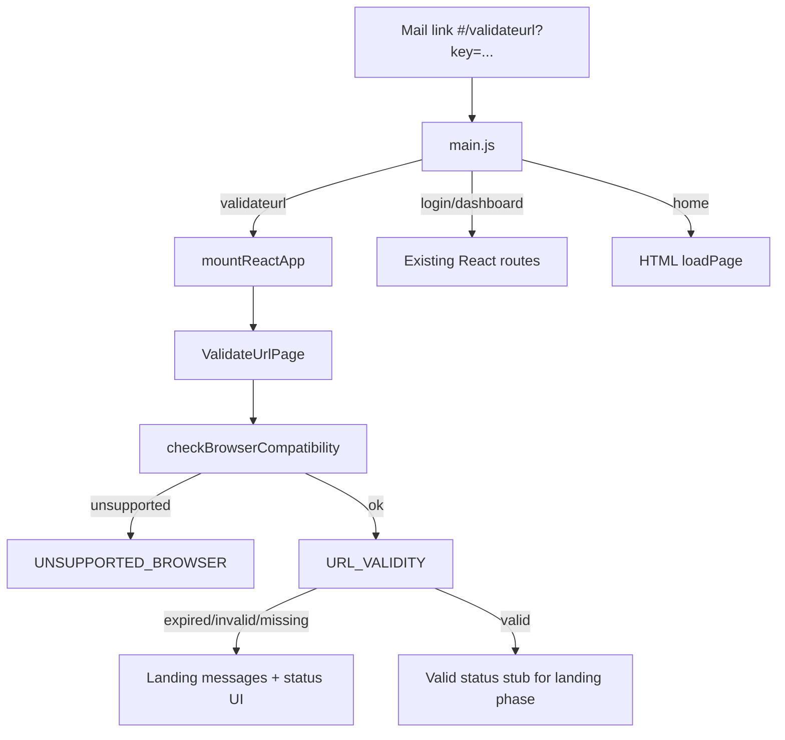

# Validate URL + browser check (validate-first slice)

**Date:** 2026-10-08  
**Status:** Approved for planning  
**Repo:** impact_vite

## Goal

Wire the **shared-mail link validate** flow so a user opening `#/validateurl` (optional `:client`) gets:

1. Browser compatibility check **before** any API call  
2. `urlvalidity` classification: valid / expired / invalid / file missing  
3. Clear status UI + landing messages  

**Client-specific landing** (logos, layout, ico, LandingUI) is **out of scope** for this slice and follows later.

## Product context

- Dashboard shares a document link by mail.  
- Recipient opens the link → validate → if valid, later phase shows client-branded landing.  
- Public HTML marketing home at `#/` stays as-is.

## Locked decisions

| Topic | Choice |
|-------|--------|
| Scope order | Validate first; landing later |
| Source paste | `temp/react-paste-unused/landing/` |
| `#/` home | Keep HTML home |
| Browser gate | Check **inside** ValidateUrl before API (not route-level `BrowserCompatibilityGate` wrap) |
| Approach | Thin ValidateUrl port into one live folder |
| DRY | Unify duplicate browserCompatibility; single message/alert path; no parallel `services/core` ghosts |

## Architecture



## Routing

- `main.js`: treat `validateurl` like `login` / `dashboard` — clear `#app`, apply `page.config`, `mountReactApp`.  
- React `HashRouter` routes: `/validateurl`, `/validateurl/:client`.  
- Query param `key` drives validation (same contract as paste).  
- HTML `#/` / `#/home` unchanged.

## File layout (live)

```
src/pages/landing/
  ValidateUrlPage.jsx    # primary UI + flow
  page.config.js
  index.js
  messages/
    landingMessageKeys.js   # subset needed this slice
    landingMessages.js
    index.js                # showLandingMessage / getLandingMessage
```

### DRY / merge

| Asset | Rule |
|-------|------|
| `src/middleware/browserCompatibility.js` | Canonical implementation |
| `src/shared/browserCompatibility.js` | Remove or re-export middleware only |
| `src/shared/BrowserCompatibilityGate.jsx` | Not used as route wrapper; may later wrap landing; fix imports or leave unused until landing phase |
| `normalizeValidateResponse` / `assertValidateAccess` | Port once to `src/shared/utils/` (missing today) |
| Alert helpers | Thin SweetAlert2 wrapper under `src/shared/alerts/` if none exists; landing messages call it |
| `apiService` `URL_VALIDITY` | Reuse live `middleware/providers/apiService` |

Paste modules for LandingUI, MarketingLanding, landingConfigService, session/accept hooks, plos stay in `temp/` until the landing phase.

## Validate flow

1. Read `key` from search params; optional `client` from path.  
2. `checkBrowserCompatibility()` → set `window.browserInfo`; if not `isAllowed && isCompatible` → `UNSUPPORTED_BROWSER` → stop.  
3. `apiService.makeRequest(API_ENDPOINTS.URL_VALIDITY, { key })` with single in-flight map per key.  
4. Normalize/assert response.  
5. Outcomes:  
   - **valid** — success status UI; optionally stash pending payload for later landing; **do not** mount LandingUI.  
   - **expired** — `EXPIRED`  
   - **invalid** — `INVALID`  
   - **file missing/deleted** — `FILE_DELETED`  
   - **network/API error** — `TRY_AGAIN` / `TRY_AGAIN_LATER`  
6. UI uses Tailwind `tw:` prefix utilities (same Bootstrap coexistence as login).

## Testing

- Unit: browserCompatibility UA fixtures; normalize/assert fixtures.  
- Playwright: `#/validateurl?key=…` with mocked `urlvalidity` — valid stub, expired/invalid messaging; optional unsupported-browser path.  
- Manual: real Tomcat shared link when available.

## Success criteria

1. `#/validateurl?key=…` mounts React ValidateUrl.  
2. Unsupported browser never hits `urlvalidity`.  
3. Valid / expired / invalid / missing each produce a clear user-facing outcome.  
4. No duplicate browserCompatibility logic in `src/`.  
5. LandingUI / client config not required for this slice to be “done.”  
6. Unit + e2e for the above paths pass; build green.

## Out of scope

- Client-branded LandingUI (logos, layout, ico, config service)  
- Route-level BrowserCompatibilityGate wrapping all React routes  
- Replacing HTML marketing home  
- Full session accept / tab-presence / PLOS flows  
- AG Grid / dashboard share-mail composer changes  

## Follow-up (later)

Landing phase: on valid validate, load client-specific config and render LandingUI; optionally promote `BrowserCompatibilityGate` as a route wrapper around landing-only routes.
