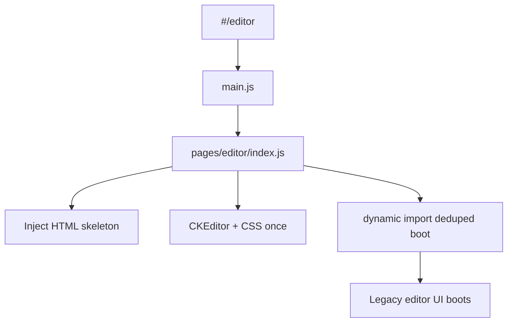

# Editor boot shell — Gulp pipelines → Vite ESM (lazy)

**Date:** 2026-10-09  
**Status:** Approved for planning  
**Repo:** impact_vite  
**Source of truth for file order:** [`src/legacy/gulp/pipeline.js`](../../src/legacy/gulp/pipeline.js) (`e6_common`, `e6_main`)  
**HTML skeleton:** [`src/pages/editor/index.html`](../../src/pages/editor/index.html)

## Goal

Make `#/editor` a real route that **lazily** boots the legacy editor UI without Gulp concat:

1. Inject the editor HTML skeleton  
2. Load CKEditor + editor/common CSS/JS **once** (no duplicate imports)  
3. Dynamically import a deduped boot chain for `e6_common` + `e6_main`  
4. Verify shell paints and CKEditor is present  

Session CHECK/CLOSE, SocketBridge, and full dialog/module graphs are **out of scope**.

## Locked decisions

| Topic | Choice |
|-------|--------|
| Scope | Slice A — boot shell only (`e6_common` + `e6_main` + CKEditor/CSS) |
| Load style | Lazy / on-demand via `import()` from `src/pages/editor/index.js` |
| Dedupe | Single ordered list; files in both bundles (e.g. `demo.js`) imported once |
| Sources | Import from `src/legacy/...` (wrappers OK); avoid copying the whole tree |
| Vendors | Prefer existing `public/` + Vite jQuery/Bootstrap; do not double-load |
| CKEditor | [`public/ckeditor4/`](../../public/ckeditor4/) |
| Session / socket | Deferred until editor shell verifies |

## Architecture

## Files

| Path | Role |
|------|------|
| `src/pages/editor/index.js` | Orchestrator: skeleton → assets → `import('./boot.js')` |
| `src/pages/editor/boot.js` | Side-effect import chain (deduped `e6_common` then `e6_main` unique files) |
| `src/pages/editor/loadEditorAssets.js` | Idempotent helpers to inject CKEditor script/CSS + editor CSS once |
| `src/pages/editor/index.html` | Existing skeleton (resolve `${{VERSION}}$` / `{{page_script}}` for Vite) |
| `src/pages/editor/page.config.js` | Document head for editor route |
| `src/main.js` | Mount `#/editor` via orchestrator; **stop** mapping editor → home |

### Boot file order (conceptual)

1. **Common** (from pipeline `e6_common`): `index.js` → globals → layout → alert/loading loaders → page/script loader → `initializer` → `editor_open` → `commonfn` → dialogsHandle / ErrorMail / Download / AlertNew (+ `demo.js` once if needed)  
2. **Editor UI** (from `e6_main`, skip already-imported): scrollspy → page events → commonEvtHandler → query-comment-system chain → `editorBootInit`  
3. **CSS once:** `main.css`, `media_query.css`, `editorLayout.css` (+ CKEditor skin CSS)

Exact paths mirror `pipeline.js`; implementation lists them in `boot.js` with comments pointing at the pipeline keys.

## Routing

- `#/editor` clears `#app`, applies editor `page.config`, calls editor `index.js` once (re-entry guard).  
- Leaving `#/editor` does not require full teardown in this slice (optional TODO).

## Error handling

- Boot/import failure → visible error banner in `#app`.  
- Missing optional assets → console warn; hard-fail only if skeleton or CKEditor core cannot load.

## Testing / success criteria

- Navigate to `#/editor`: navbar/skeleton visible  
- `window.CKEDITOR` (or loaded ckeditor script) present  
- DevTools: each boot JS/CSS file loaded at most once  
- Build succeeds  
- No session grant / Accept wiring required for this slice  

## Later (not this spec)

- Landing Accept → CHECK → grant → `#/editor`  
- Multi-session / send-request / SocketBridge  
- `dialog_module`, `module_main`, `single_module`, `session_editor` bundles
