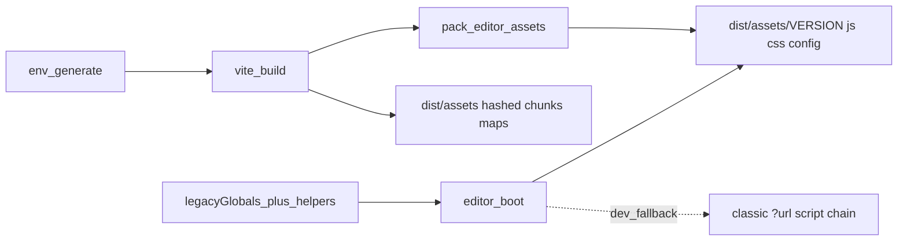

# Editor Hybrid Assets Pack — Design

**Date:** 2026-10-09  
**Status:** Approved for planning  
**Related:** [editor-boot-esm](./2026-10-09-editor-boot-esm-design.md), [landing-accept-legacy-session](./2026-10-09-landing-accept-legacy-session-design.md)

---

## Goal

Keep the Vite SPA on hashed chunks + source maps, and after build emit **gulp-shaped editor legacy bundles** under `dist/assets/{VERSION}/…` so `#/editor` can load versioned paths and stop console failures caused by missing globals / `assets/{VERSION}/config/` expectations.

## Locked decisions

| Decision | Choice |
|----------|--------|
| Build shape | **Hybrid:** SPA = Vite chunks + maps; editor legacy = `assets/{VERSION}/` packs |
| VERSION source | `window.ENV.VERSION` (generate-env) if set, else `package.json` `"version"` |
| Packaging approach | **Post-build pack script** after `vite build` (not dual Vite lib builds, not gulp proxy) |

## Non-goals

- Full gulp vendor / `dialog_module` / module_main parity  
- Dual Vite `build.lib` graphs for e6  
- Loading editor assets from a parallel gulped `impactweb` dist  
- CKEditor content load / dialog phases (later roadmap)

---

## Architecture

1. `npm run env:generate` writes `public/env.js` (may include `VERSION`).
2. `vite build` emits SPA bundles under `dist/assets/*-{hash}.js` (+ `.map`).
3. `scripts/pack-editor-assets.js` concatenates current editor Slice A JS/CSS (same order as [`manifest.js`](../../../src/pages/editor/manifest.js)) into `dist/assets/{VERSION}/js|css/`, and copies or stubs the minimal `config/` tree the script loader expects.
4. Editor boot sets helpers + `window.VERSION`, then prefers versioned URLs; falls back to existing `?url` injection in pure `vite`/`dev` when packs are absent.

---

## Components

| Unit | Responsibility |
|------|----------------|
| `resolveEditorVersion()` | `ENV.VERSION` \|\| `package.json.version` |
| `scripts/pack-editor-assets.js` | Write `dist/assets/{VERSION}/…`; fail build if a manifest source is missing |
| `package.json` scripts | `build`: env → vite → pack |
| `editorLegacyHelpers.js` (or extend `legacyGlobals.js`) | Port safe helpers from skipped `src/legacy/js/index.js` (`isValidVariable`, `IS_TRACK_VIEW` defaults, etc.) without `${{…}}$` placeholders |
| Editor boot / loaders | Prefer `/assets/{VERSION}/…`; keep classic `?url` fallback for local HMR |

### Pack outputs (minimum)

Mirror gulp naming enough for boot + config loader:

- `dist/assets/{VERSION}/js/e6_common.js` (or `.min.js` if matching existing HTML conventions — pick one and stick to it in the plan)
- `dist/assets/{VERSION}/js/e6_main.js`
- `dist/assets/{VERSION}/css/…` from `EDITOR_CSS_PATHS`
- `dist/assets/{VERSION}/config/…` minimal stubs or copied clientconfig paths so `FOLDER_PATH = 'assets/' + VERSION + '/config/'` does not 404 hard

SPA hashed files remain siblings under `dist/assets/` (not inside `{VERSION}/`).

---

## Data flow

1. Resolve VERSION → set on `window.ENV` / `window.VERSION` at runtime via existing env + globals.
2. Build produces SPA + versioned editor packs.
3. Accept → `#/editor?docid=…` → helpers → load versioned (or fallback) scripts → shell without `isValidVariable is not a function`.

---

## Error handling

- Pack script: exit non-zero if any concat input path is missing.
- Boot: if preferred versioned URL 404s, fall back to `?url` chain once; if both fail, existing editor error banner.
- Do not invent silent empty VERSION folders.

---

## Testing

- Unit: `resolveEditorVersion` (env vs package.json); helper smoke (`isValidVariable`).
- Build smoke: after `npm run build`, assert `dist/assets/{VERSION}/js/` exists and contains packed files.
- E2E: Agree → editor; assert no console error matching `isValidVariable is not a function` during boot (allow unrelated warnings if needed).

---

## Success criteria

- SPA still ships Vite chunks + source maps.  
- Editor legacy lives under `assets/{VERSION}/` after build.  
- `#/editor` boot no longer fails on missing `isValidVariable` / missing VERSION folder path for the packed Slice A set.
