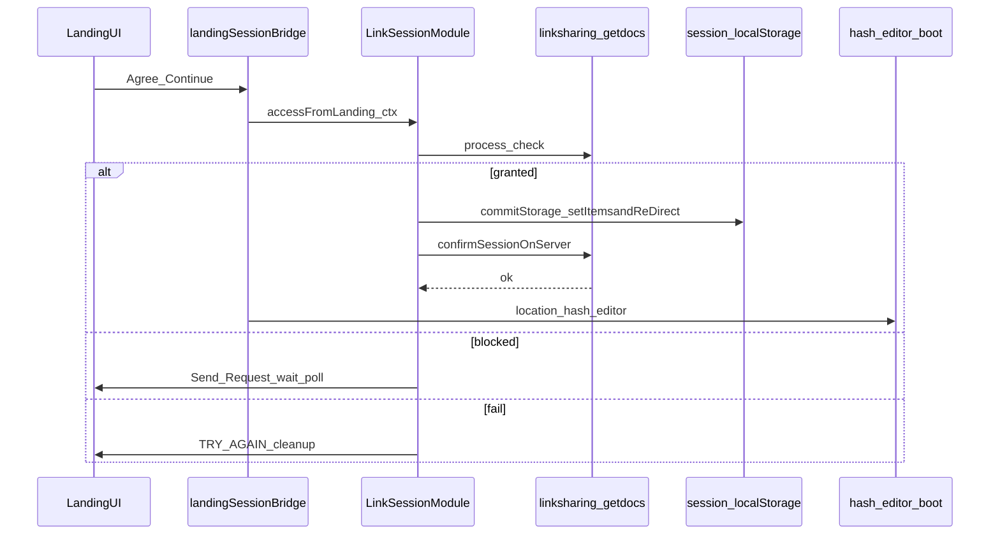

# Landing Accept → Editor (Legacy LinkSession) — Design

**Date:** 2026-10-09  
**Status:** Approved for planning  
**Authoritative flow docs:** [`docs/linksharing-session/`](../../linksharing-session/) (not this folder’s prior Phase-1 stubs)  
**Source of truth for dual-guard:** `skills.md` / `WORKFLOW.md` / `DEV.md` under linksharing-session

---

## Goal

Enable **AGREE & CONTINUE** on [`LandingUI.jsx`](../../../src/pages/landing/LandingUI.jsx) so that Accept runs the **full dual-guard landing grant** and then opens the existing `#/editor` boot shell.

## Non-goals (this slice)

- Porting React paste session (`temp/react-paste-unused/middleware/session` → `src/services/session`)
- SocketBridge landing presence
- PLOS OTP / reCAPTCHA before Accept
- Editor `InitialLoadDialog` dual-guard / content load / dialogs
- Moving editor e6 js/css into `src/pages/editor/{js,css}` (Phase 2+)

---

## Two session stacks

| Stack | Location | Phase 1 |
|-------|----------|---------|
| **Legacy LinkSession** | `src/legacy/modules/shared/link_session/` | **Use immediately** |
| React paste session | `temp/react-paste-unused/middleware/session/` | Deferred swap later |

Hooks such as `useLandingSessionFlow.js` import missing `src/services/session/*` and `sessionDialogs.js`. They stay unused until a later React swap.

---

## Phased roadmap (context)

1. **This slice:** Landing Accept → legacy dual-guard → `#/editor` shell  
2. Editor core UI js/css → colocate under `src/pages/editor/{js,css}`  
3. CKEditor + document content loading  
4. Dialogs + supporting modules under page folders  

Each later phase moves only the legacy files that phase needs into the owning page folder.

---

## Architecture (Phase 1)

### Behavioral requirements (from linksharing-session)

1. Agree builds a landing session context from validate `docData`.
2. `LinkSessionModule.getInstance().accessFromLanding(ctx)` (or equivalent) runs `process: check`.
3. On grant: commit **sessionStorage** (`docid`, `xmleditor:sessionid:{docid}`, redirect) + **sessionbackup** + **localStorage** legacy share keys via existing `commitStorageAndRedirect` / `setItemsandReDirect` path.
4. **Write then verify:** await getdocs dual-guard unless `skipVerify` (poll-approved grants per DEV.md inventory).
5. Only on verify ok: navigate to `#/editor` (HashRouter).
6. Fail closed: cleanup backups; no navigate on verify fail; Send Request / wait / poll for blocked path.
7. `onRedirect` must **await** async storage+verify so navigate cannot race writes.

---

## Components

| Unit | Responsibility |
|------|----------------|
| `src/pages/landing/js/session/` | Colocated legacy `link_session` graph moved from `src/legacy/modules/shared/link_session/` (minimum set for landing grant) |
| `loadLandingSession.js` (or equivalent) | Ordered classic `?url` script injection (same pattern as editor `boot.js`) so `window.LinkSessionModule` exists |
| `landingSessionBridge.js` | Thin React-callable API: build ctx from `docData` → `accessFromLanding` → resolve navigate / errors |
| `LandingUI.jsx` | Enable AGREE; call bridge; busy/disabled while in flight |

Do **not** reimplement dual-guard in React. Reuse legacy core.

---

## Data flow

- **Input:** `docData` from validateurl landing (already on `LandingUI`).
- **Side effects:** sessionStorage + localStorage keys expected by editor SharedKey / session restore (same as gulp landing).
- **Output:** `location.hash = '#/editor'` → existing [`src/pages/editor/index.js`](../../../src/pages/editor/index.js) shell.

---

## Error handling

- Transport / check `r:0` that is not a send-request conflict: show try-again; no redirect.
- Verify `no_active_row`: silent landing_retry up to 3× if legacy already does; else TRY_AGAIN + cleanup.
- Missing globals after script load: surface boot error in UI; do not navigate.

---

## Testing

- Unit: ctx builder + bridge happy path with mocked `LinkSessionModule`.
- E2E (mocked `linksharing` + `getdocs`): Agree → `#/editor` visible shell + `CKEDITOR` global; assert storage keys when mocks return grant.
- Manual: Network order `linksharing` then `getdocs` before hash change.

---

## Later swap (out of scope here)

Port paste middleware into `src/services/session` and replace the legacy bridge with `useLandingSessionFlow`, preserving the same dual-guard behavior.
