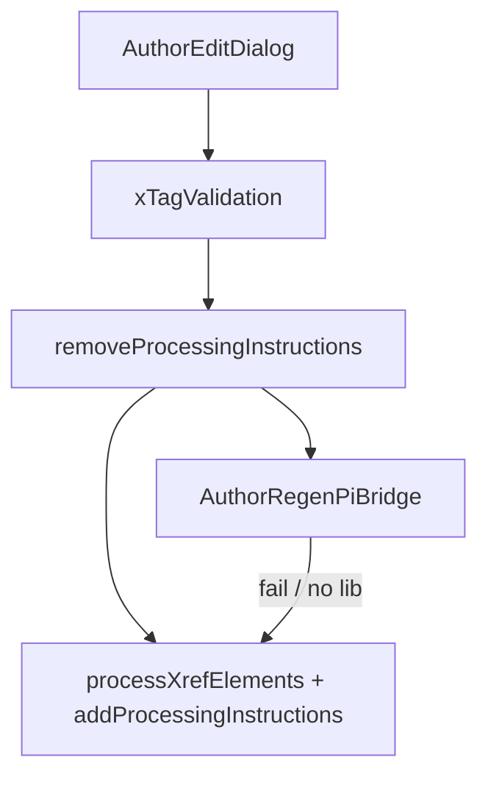

# Regen-pi — Developer Guide

See [README.md](./README.md), [skills.md](./skills.md), [RUN.md](./RUN.md), [QA.md](./QA.md).

## Architecture

```text
Vitest (XML string)
  fixtures → stripPistart → RegenPi.regen → assert golden

Editor runtime (HTML)
  AuthorEditDialog Update_fire / Event_Trigger
    → AuthorGroupNewModule.xTagValidation
      → removeProcessingInstructions
      → AuthorRegenPiBridge.applyToContrib  (if shouldUse)
           resolveEngine: regenPi opts → else M_SCOPE
           apply given-names / between-xrefs / between-contribs
      → addProcessingInstructionsToElements (skipGivenNames when bridge)
      → else legacy processXrefElements + full PI helpers
```



## Engine API (`regen-pi.js` / `RegenPiLib`)

| API | Notes |
|-----|--------|
| `RegenPi.fromXml(xmlText)` | Needs `DOMParser` (happy-dom in Vitest) |
| `RegenPi.fromXmlDoc(doc)` | Prefer live journal `XML_DOC` when calling explicitly |
| `RegenPi.fromConfig(cfg)` | Built configs (bridge M_SCOPE path) |
| `RegenPi.fromClientConfig(entry, opts)` | Only when caller passes a real client-config entry |
| `engine.select(classname)` | `given-names`, `between-xrefs`, `between-contribs`, … |
| `engine.regen(stripXml)` | XML-string insert for those three slots |
| `stripPistart` / `makePistart` | XML PI strip / build helpers |
| `stripHtmlPistart` | Remove HTML `span.pistart` (Phase 1 parity) |
| `resolveOneDoc` | One docid from meta/documents (`src/js/regen_pi/resolveOneDoc.js`) |
| `roleOf` / `pickBetweenContribsRule` | between-contribs role selection |

### Errors

- `RegenPiError` on blank Option B `classname`, missing `<pi-config>`, bad inputs.

## Bridge API (`AuthorRegenPiBridge`)

| API | Notes |
|-----|--------|
| `shouldUse(authorModule)` | `RegenPiLib` present + `M_SCOPE` |
| `buildConfigFromAuthorScope(authorModule)` | Maps `givenname_sep`, `cross_link_sep`, `contrib_sep`, `last_sep` |
| `resolveEngine(authorModule, opts)` | Explicit pi-config first, else M_SCOPE |
| `makeHtmlPistart(doc, value)` | Creates editor pistart span |
| `applyToContrib(el, info, authorModule, options, index, count)` | Applies three slots; returns boolean |

### HTML parity guards

- **Collab:** trust `contributorInfo.isLastBefore` / `isLastAuthor` (not raw `roleOf` alone).  
- **PLOS:** between-xrefs only between `data-role="aff"` pairs.  
- **Corresp:** skip sep when next sibling is empty `ref-type="corresp"` xref.  
- **AuthorModule:** re-append `a.xref` to contrib end before placing seps (dialog preview path).  
- **lastpi:** set on between-contribs PI when last-before / non-last with xrefs.  
- **Last author:** no empty pistart append.

## Gulp / load order

`utils/gulp/pipeline.js` includes `src/js/dialogModules/*.js`. Both `regenPiLib.js` and `authorRegenPiBridge.js` ship in that bundle. `xTagValidation` runs after page load, so script alphabetical order is not a runtime issue for deferred calls.

## Sync checklist (engine change)

1. Edit `src/js/regen_pi/regen-pi.js`.  
2. Mirror into `src/js/dialogModules/regenPiLib.js` (UMD factory return list).  
3. Update fixtures/tests under `tests/unit/regen_pi/`.  
4. Run commands in [RUN.md](./RUN.md).  
5. Update [QA.md](./QA.md) if behavior or smoke steps change.
