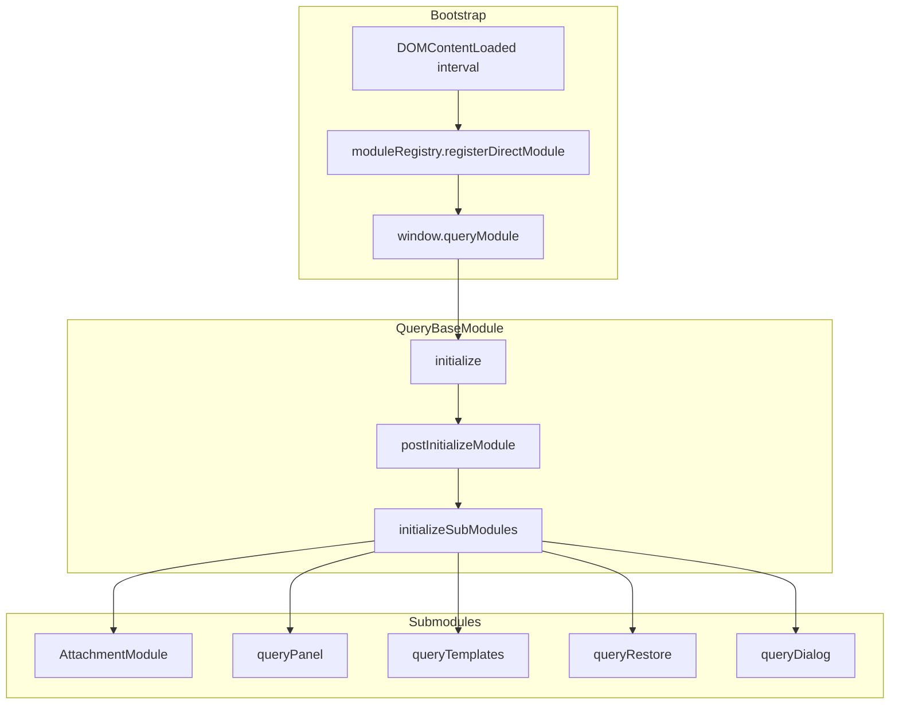

# Comment Query Module

The comment/query system manages **author queries (AQ)**, **comments**, and **responses** in the IMPACT editor and track view. Config group: `commentQueryGroup`.

**Agent runbook:** [skills.md](./skills.md)  
**Developer guide:** [DEV.md](./DEV.md)  
**QA checklist:** [QA.md](./QA.md)  
**Test cases:** [TestCase.md](./TestCase.md)

---

## Runtime code location

All classes and bootstrap live in ordered source files (merged at build for `e6_main` / `e6_Track`):

| File | Role |
|------|------|
| [`bootstrap.js`](./bootstrap.js) | `DOMContentLoaded` shell, shared constants |
| [`QueryBaseModule.js`](./QueryBaseModule.js) | Core orchestrator |
| [`AttachmentModule.js`](./AttachmentModule.js) | Uploads |
| [`QueryPanelModule.js`](./QueryPanelModule.js) | Left panel UI |
| [`QueryRestoreModule.js`](./QueryRestoreModule.js) | Backup restore |
| [`QueryTemplates.js`](./QueryTemplates.js) | Panel/dialog templates |
| [`QueryUtils.js`](./QueryUtils.js) | Static helpers |
| [`QueryDialogModule.js`](./QueryDialogModule.js) | Modal + collator verify |
| [`register.js`](./register.js) | Module registry bootstrap |

Build order: [`utils/gulp/pipeline.js`](../../../utils/gulp/pipeline.js) → `QUERY_COMMENT_SYSTEM_JS`.

This folder is the **canonical documentation and source home** — not a webpack module entry.

---

## Architecture

## Classes (in `query.js`)

| Class | Role |
|-------|------|
| `QueryBaseModule` | Core orchestrator: state, CRUD, config, DOM sync, events |
| `QueryPanelModule` | Left panel UI (`#query_panel`, `#comment_panel`, `#addcmt`) |
| `QueryDialogModule` | Create/edit modal; collator verify stepper; extends `BaseModule` |
| `QueryRestoreModule` | Backup scan and restore of deleted query markers |
| `QueryTemplates` | HTML templates for panel list items and quick-reply buttons |
| `AttachmentModule` | Uploads for dialog and panel replies |
| `QueryUtils` | Static helpers (debounce, fetch, sanitize) |

Registry name: **`querySystem`**. Primary global: **`window.queryModule`**.

---

## Initialization

### Editor page

1. `DOMContentLoaded` starts a short interval until `moduleRegistry` and `BaseModule` exist.
2. `await moduleRegistry.registerDirectModule({ name: 'querySystem', moduleClass: QueryBaseModule, type: 'onthefly' })`
3. `window.queryModule = await moduleRegistry.getModule('querySystem')`
4. `moduleRegistry` calls `initialize()` then `postInitializeModule()` on the instance.

**`postInitializeModule()`** → **`initializeSubModules()`** (editor only):

1. `this.attachmentModule = new AttachmentModule()`
2. Register lazy modules: `queryPanel`, `queryRestore`, `queryTemplates`
3. Register onthefly: `queryDialog` via `getQueryDialogModuleConfig()`
4. `await moduleSystem.getModule(...)` for all four submodules
5. `this.dialogModule.parent = this`; `window.queryDialog = this.dialogModule`

### Track view (`IS_TRACK_VIEW`)

- `window.queryModule = new QueryBaseModule('querySystem')` when registry path is unavailable
- `initializeSubModules` uses direct `new QueryPanelModule` / `QueryTemplates` (no `queryDialog` / `moduleSystem`)

---

## Globals and module IDs

| Global / ID | Expected type | Notes |
|-------------|---------------|-------|
| `window.queryModule` | `QueryBaseModule` | Parent orchestrator |
| `window.queryModule.dialogModule` | `QueryDialogModule` | Preferred reference from core |
| `window.queryDialog` | `QueryDialogModule` | Legacy API; must **not** be the DOM node |
| `document.getElementById('queryDialog')` | `HTMLElement` | Dialog panel root (`id` matches module id by convention) |
| `MODULE_LIST.queryDialog` | `QueryDialogModule` | Legacy dialog event routing |

Always **`await`** `moduleSystem.getModule(...)` — bare calls return a Promise.

---

## User entry points

| UI | Code path |
|----|-----------|
| Comment panel **Add** (`#addcmt`) | `QueryPanelModule.handleTabClick` → `dialogModule.open()` |
| Editor context menu | `ADD_NEW_CMD` / `ADD_NEW_QRY` commands |
| Toolbar **Add Comment** | CKEditor `add_comment` command → `queryDialog.open(null, 'comment')` |
| External workflows | `window.queryDialog.open(id, process, options)` — figures, ref_form, notes_group, etc. |
| Marker click in editor | `QueryBaseModule.evtFromEditor` → `dialog.open(queryId, status)` |
| Collator verify | `queryModule.openVerifyDialog()` or `queryDialog.openVerify()` |

---

## Configuration

- `loadConfiguration()` reads `I_CONFIG` → `commentQueryGroup`, `NoteDialogModule`
- `SHOW_CONTEXT_GROUP` from `IsContextMenu('commentQueryGroup')`
- Role-based quick replies: `config.roleBasedResponses` (author vs collator, client-specific `responses_*` keys)
- Collators default to `globalQuickReplyMode: true` (`Approved`, `Pending`, `TS Notes`)

---

## Related files

| File | Purpose |
|------|---------|
| [`src/js/query.js`](../../js/query.js) | All query system classes and bootstrap |
| [`src/static/css/Dialogs/QueryCommentModule.scss`](../../static/css/Dialogs/QueryCommentModule.scss) | Panel + verify footer styles |
| [`src/modules/ContextMenuGroup.js`](../ContextMenuGroup.js) | `moduleSystem`, `registerModule`, late command registration |
| [`ckeditor/plugins/impact/plugin.js`](../../../ckeditor/plugins/impact/plugin.js) | `add_comment` toolbar command |
| [`snippet/editor6.html`](../../../snippet/editor6.html) | Panel markup (`#addcmt`, `#query_panel`, `#comment_panel`) |
| [`src/js/editor_readonly.js`](../../js/editor_readonly.js) | Track view integration |
| [`docs/query-system-docs.md`](../../../docs/query-system-docs.md) | Extended workflow and validation reference |

---

## Testing

- E2E: [`tests/e2e/modules/insert-comment-basic.spec.js`](../../../tests/e2e/modules/insert-comment-basic.spec.js), [`query-comment.spec.js`](../../../tests/e2e/modules/query-comment.spec.js), [`query-workflow.spec.js`](../../../tests/e2e/modules/query-workflow.spec.js)
- Selectors: [`tests/e2e/data/selectors.json`](../../../tests/e2e/data/selectors.json) (`#queryDialog`, `#addcmt`)
- Manual cases: [TestCase.md](./TestCase.md)

---

## Common pitfalls

1. **`window.queryDialog` is a DOM element** — occurs if module global is not reassigned after `createDialog()`; use `dialogModule` or `await getModule('queryDialog')`.
2. **Context menu commands missing** — `queryDialog` registered after `instanceReady` without late `setupModuleCommands` hook.
3. **`dialogModule` is a Promise** — assigned without `await` on `getModule`.
4. **Track view** — do not assume `moduleSystem` or `queryDialog` exist.
5. **Default DOM `pending` stamp** — collator load sets `data-collation-status="pending"` on queries with responses; this does **not** mean verify is done (see [DEV.md](./DEV.md)).
